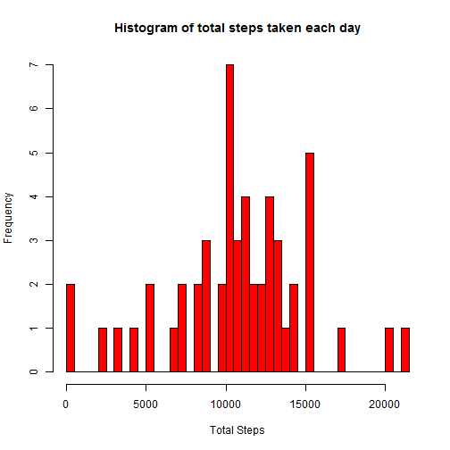
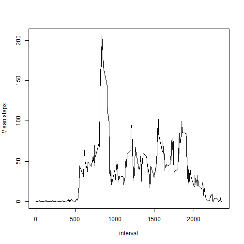
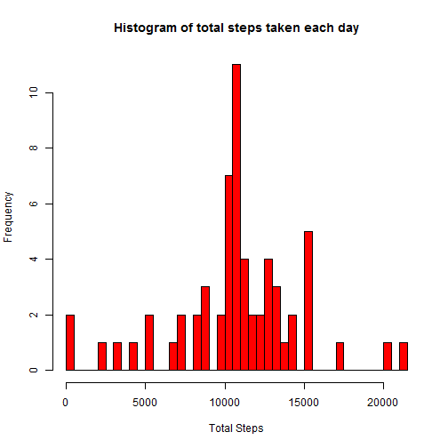
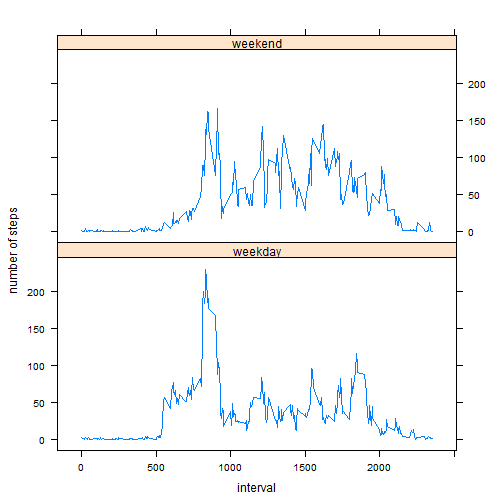

# Reproducible Research: Peer Assessment 1

## Loading and preprocessing the data


The original zip file from the repository has been unzipped. The data has been imported using the code below into the data frame ```rawData```


```r
unzip("activity.zip")
rawData <- read.csv("activity.csv")
```


## What is mean total number of steps taken per day?


```r
total_steps <- aggregate(steps ~ date, data = rawData, sum)
hist(total_steps$steps, col = "red", main = "Histogram of total steps taken each day", xlab = "Total Steps", breaks = 50)
```

 

```r
mean(total_steps$steps)
```

```
## [1] 10766.19
```

```r
median(total_steps$steps)
```

```
## [1] 10765
```


## What is the average daily activity pattern?


```r
dailyPattern <- aggregate(steps ~ interval, data = rawData, mean)
with(dailyPattern, plot(interval, steps, type = "l", ylab = "Mean steps"))
```

 

Below is the code to find the interval containing the maximum number of steps:

```r
dailyPattern[which.max(dailyPattern$steps),1]
```

```
## [1] 835
```

## Imputing missing values

The number of missing values (```NA```) in the data set is 2304.

```r
sum(is.na(rawData))
```

```
## [1] 2304
```
I have taken the strategy of imputing the missing values in the data set with the mean number of steps taken for the 5 minute interval, as calculated already in the data frame ```dailyPattern```. The code below shows the steps taken:

```r
dataImputed <- merge(rawData, dailyPattern, by="interval")

for (i in seq_along(dataImputed$steps.x)) {
  if (is.na(dataImputed$steps.x[i])) dataImputed$steps.x[i] <- dataImputed$steps.y[i]
}
dataImputed <- dataImputed[,1:3]
colnames(dataImputed) <- c("interval", "steps", "date")

totalStepsImputed <- aggregate(steps ~ date, data = dataImputed, sum)
hist(totalStepsImputed$steps, col = "red", main = "Histogram of total steps taken each day", xlab = "Total Steps", breaks = 50)
```

 

The result of imputing missing values in this way is that the mean total number of steps is unchanged, however the median total number of steps changes to become the same as the mean.

```r
mean(totalStepsImputed$steps)
```

```
## [1] 10766.19
```

```r
median(totalStepsImputed$steps)
```

```
## [1] 10766.19
```

## Are there differences in activity patterns between weekdays and weekends?


```r
weekendLogic <- weekdays(as.Date(dataImputed$date)) == "Saturday" | weekdays(as.Date(dataImputed$date)) == "Sunday"

weekdayData <- cbind(dataImputed, weekday = !weekendLogic)

for (i in seq_along(weekdayData$weekday)) {
  if(weekdayData$weekday[i]) weekdayData$weekday[i] <- "weekday"
	else weekdayData$weekday[i] <- "weekend"
}

weekdayData$weekday <- as.factor(weekdayData$weekday)
```
This is the how the first six rows of the new data set:

```r
head(weekdayData)
```

```
##   interval    steps       date weekday
## 1        0 1.716981 2012-10-01 weekday
## 2        0 0.000000 2012-11-23 weekday
## 3        0 0.000000 2012-10-28 weekend
## 4        0 0.000000 2012-11-06 weekday
## 5        0 0.000000 2012-11-24 weekend
## 6        0 0.000000 2012-11-15 weekday
```
I have used a lattice plot to show the difference in pattern from the daily activity pattern on weekends and weekdays:

```r
library(lattice)
weekdayPattern <- aggregate(steps ~ interval + weekday, data = weekdayData, mean)
dayFig <- xyplot(steps ~ interval | weekday, data = weekdayPattern, layout = c(1, 2), type = "l", ylab = "number of steps")

print(dayFig)
```

 
