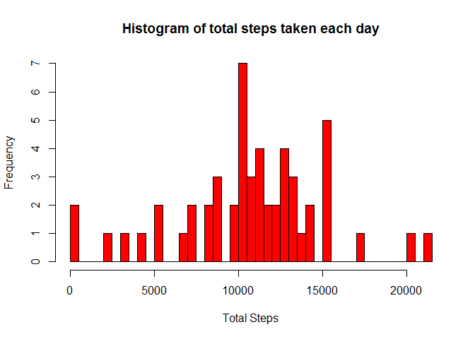
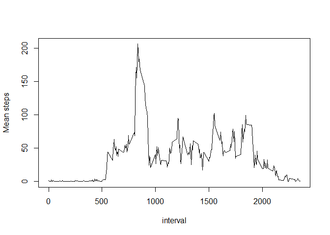
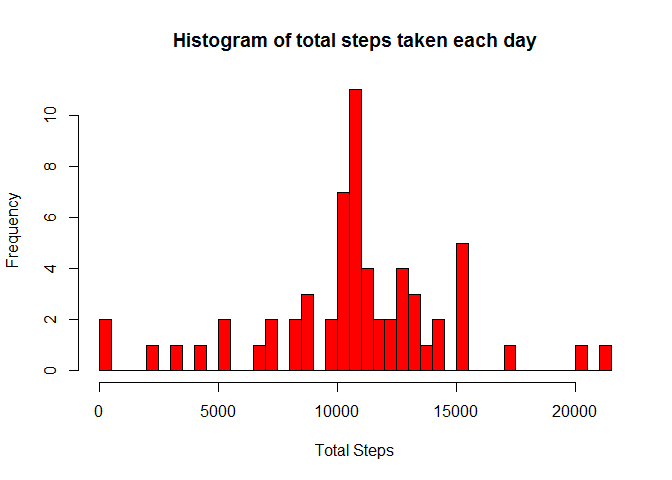

# Reproducible Research: Peer Assessment 1


## Loading and preprocessing the data


```r
unzip("activity.zip")
rawData <- read.csv("activity.csv")
```


## What is mean total number of steps taken per day?


```r
total_steps <- aggregate(steps ~ date, data = rawData, sum)
hist(total_steps$steps, col = "red", main = "Histogram of total steps taken each day", xlab = "Total Steps", breaks = 50)
```

 

```r
mean(total_steps$steps)
```

```
## [1] 10766.19
```

```r
median(total_steps$steps)
```

```
## [1] 10765
```


## What is the average daily activity pattern?


```r
dailyPattern <- aggregate(steps ~ interval, data = rawData, mean)
with(dailyPattern, plot(interval, steps, type = "l", ylab = "Mean steps"))
```

 

```r
dailyPattern[which.max(dailyPattern$steps),1]
```

```
## [1] 835
```

## Imputing missing values


```r
sum(is.na(rawData))
```

```
## [1] 2304
```

```r
dataImputed <- merge(rawData, dailyPattern, by="interval")

for (i in seq_along(dataImputed$steps.x)) {
  if (is.na(dataImputed$steps.x[i])) dataImputed$steps.x[i] <- dataImputed$steps.y[i]
}
dataImputed <- dataImputed[,1:3]
colnames(dataImputed) <- c("interval", "steps", "date")

totalStepsImputed <- aggregate(steps ~ date, data = dataImputed, sum)
hist(totalStepsImputed$steps, col = "red", main = "Histogram of total steps taken each day", xlab = "Total Steps", breaks = 50)
```

 

```r
mean(totalStepsImputed$steps)
```

```
## [1] 10766.19
```

```r
median(totalStepsImputed$steps)
```

```
## [1] 10766.19
```

## Are there differences in activity patterns between weekdays and weekends?
